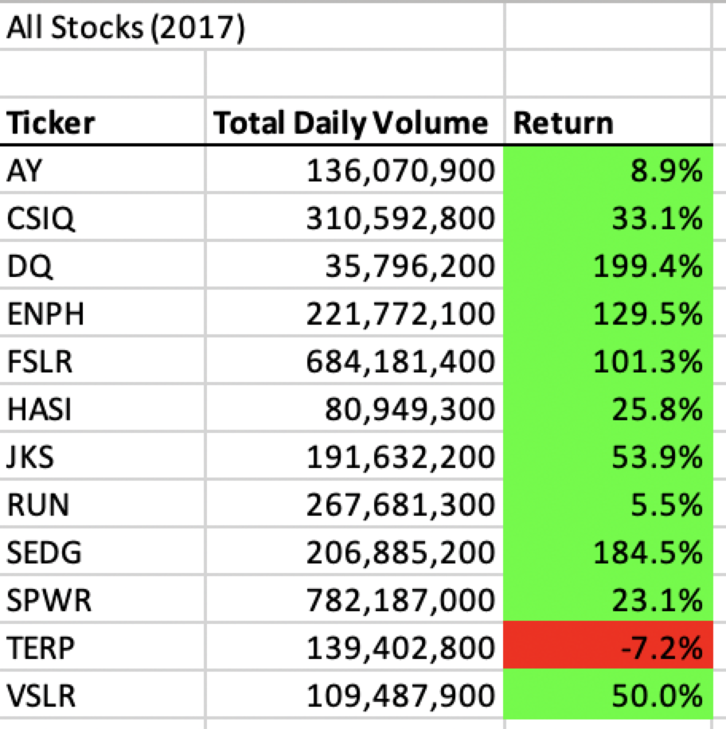
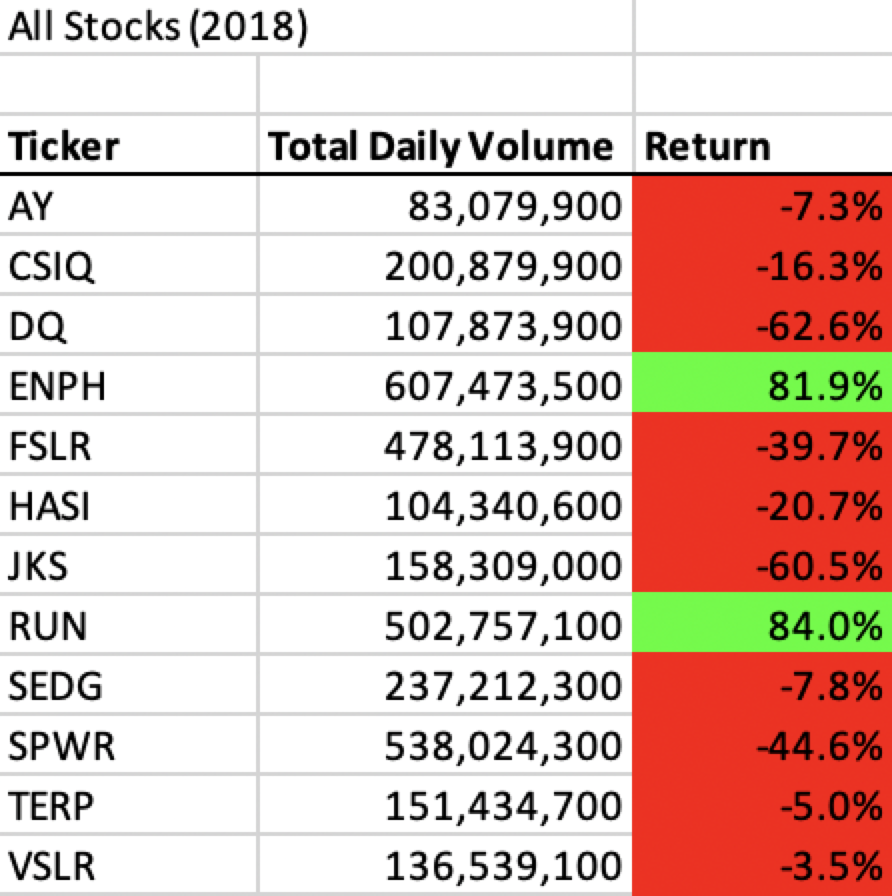

# VBA of Wall Street

## Overview of Project
The purpose of this analysis is to help Steve to expand the dataset to include
the entire stock market over the last few years. And we are using the Visual
Basic Application to work directly with Excel worksheets and cells, so we are
able to write scripts to automate simple tasks and to write complicated scripts
to perform complex analyses, which we wouldn't be able to do with Excel alone.
Moreover, we are trying to refactor the the module 2 solution to collect the
same information that I did in previous module.

### Purpose
By writing the VBA ourselves can help us better study the coding style and rules
of VBA. And by comparing the runtime of two codes we did, we can better study
how to use the VBA to solve problems. Since the running time for code is extremely
important in coding，so we also need to know how to write code in order to minimize
the running time to save memory.

## Analysis and Challenges
Since the VBA is a new programming language to me, so I will need to spend time
on how to use this language, and the style of this language. I feel the most
hard part is to connect the excel worksheets with the vba codes.

### Challenges and Difficulties Encountered

I have several runtime error when i am trying to compile my code, but i fixed it
by running step by step to find the error.

## Results

- Run time screenshot of 2017 and 2018

- images of code Results

- Comparsion

By comparing the runtime of refactor code with original module, our refactor runs
much faster then the original code. The results of refactoring code is the exactly
same a the original code output.

## Summary

- advantages and disadvantages of refactoring code in general

The refactoring code runs much faster which not only save a lot of time but also
the memory. In a lot of other cases, the data is huge, we need our code to run in
limited amount of time. Moreover, simplifying the code will help us to easily add
more code in the future. However, the refactoring code has many places of hard coding
which is really dangerous. If everything is hard coded, then the code has limited
amount room to be reused in the future.

The original code is complex, which is hard for people to read and understand
at first glance, and there are several redundant variables can be deleted to
simplify the code. Moreover, since there are nested for loops involved to cause
the runtime increases, and it is an overall bad design.
